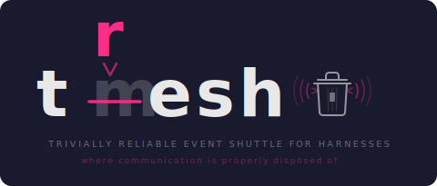

<p align="center">
  
</p>

<h3 align="center">The tmux agent shuttle that mass-produces nothing at scale.</h3>

Zero-polling push between AI agent sessions via `tmux wait-for`. 450 lines. Zero dependencies. It was supposed to be a mesh.

It isn't. It works anyway.

```bash
tresh send bob "hello"    # alice sends
tresh watch               # bob receives instantly (zero CPU)
tresh broadcast "hi all"  # send to every node
```

<details>
<summary>The full backstory (for those who enjoy watching ambition meet reality at speed)</summary>

The project was originally called tmesh, because it was going to be a mesh network for AI agents running in tmux sessions, and if there is one thing software developers are constitutionally incapable of resisting, it is naming something after what they intend it to become rather than what it is. The mesh never happened. What happened instead was a single point-to-point message shuttle between exactly two tmux panes, which is to a mesh roughly what a paper cup on a string is to the telecommunications infrastructure of a mid-sized European nation. The developers, displaying the kind of pattern recognition that explains a great deal about the state of the industry, looked at this and said "close enough."

The name "tresh" emerged from the rubble in the way that names do when you have spent three days trying to build a distributed system and have produced instead a thing that sends a string from pane A to pane B and then stops, exhausted, like a postal worker who has been told the entire route is just the house next door. Someone mistyped "tmesh" in a commit message. Nobody corrected it. This is how all great engineering decisions are made: through fatigue, typos, and the quiet understanding that fighting entropy is not so much futile as it is rude.

The astonishing part -- and this is the part that should make you suspicious, because software that works on the first try is software that is planning something -- is that tresh actually does the one thing it does rather well. It uses `tmux wait-for` to achieve zero-polling push-based communication, a technique so obvious that essentially nobody else has bothered to implement it, presumably because it would mean admitting that the solution to their architecture problem was already sitting there in a man page from 2013. The entire implementation is 450 lines of TypeScript with zero dependencies, a fact which in modern software development is roughly as unusual as encountering a fish that has strong opinions about tax policy.

It ships under the label "sparkling slop," which is the kind of branding that happens when you have given up on making promises you cannot keep and have decided instead to make promises you have no intention of making in the first place. The tagline promises nothing. The software delivers it.

</details>

## What it does

Arguably every AI coding agent or harness should run in a tmux session. tresh lets those sessions talk to each other -- zero sockets, zero daemons, zero infrastructure beyond the tmux you -- arguably -- should already be running.

## Install

```bash
git clone https://github.com/sparklingslop/tresh.git
cd tresh && bun install
```

Run via:

```bash
bun run src/cli.ts ls          # from the repo
alias tresh='bun run src/cli.ts'  # or alias it
```

## Quick start

```bash
# Terminal 1: identify and watch
export TRESH_ID=alice
tresh watch

# Terminal 2: send a message
export TRESH_ID=bob
tresh send alice "hello from bob"

# Terminal 1 shows:
# [00:42:15] bob: hello from bob
```

## How it works

```
  Session A (Claude)          Session B (Aider)
  +-----------------+         +-----------------+
  | TRESH_ID=a      |         | TRESH_ID=b      |
  |                 |         |                 |
  | tresh send b msg --------- ~/.tresh/b/inbox/|
  |                 |  write  |  1712...-x7k.json
  |                 |         |                 |
  |                 |  wake   | tmux wait-for   |
  |                 --------- | (zero-CPU block)|
  +-----------------+         +-----------------+
```

**Discovery**: `tmux list-sessions` finds who is online. Sessions set `TRESH_ID` in the tmux environment.

**Send**: Write a JSON signal file to the target's inbox directory, then wake the receiver with `tmux wait-for -S`.

**Receive**: Block on `tmux wait-for` (zero CPU) until a signal arrives, then read the inbox. No polling needed.

**Inject**: For direct push, `tmux send-keys` injects text straight into a pane's input.

## Two transport modes

| Mode | Mechanism | Use case |
|------|-----------|----------|
| **Async (send/recv)** | File inbox + `tmux wait-for` | Reliable, structured messaging |
| **Direct (inject)** | `tmux send-keys` | Real-time push into agent input |

## Three watch modes

```bash
tresh watch              # auto: push via wait-for, poll fallback
tresh watch --push       # push only (requires tmux)
tresh watch --poll 500   # poll every 500ms (no tmux needed)
```

## CLI

```
tresh ls                      List mesh nodes (tmux sessions)
tresh send <target> <body>    Send signal to target's inbox
tresh inject <target> <text>  Push text into target's pane
tresh watch [--poll <ms>]     Watch inbox for incoming signals
tresh inbox                   Read pending signals (one-shot)
tresh identify <name>         Set this session's mesh identity
```

## Library API

```typescript
import { discover, send, watch, inject, inbox, identify } from "tresh";

// Set identity
identify("my-agent");

// Find peers
const nodes = discover();

// Send a signal
send("other-agent", "hello");

// Watch for signals (push mode)
const stop = watch((signal) => {
  // signal: { from, to, body, ts }
}, { mode: "push" });

// One-shot inbox read
const signals = inbox();

// Direct injection
inject("session-name", "some text");
```

## Signal format

```json
{ "from": "alice", "to": "bob", "body": "hello", "ts": 1712451200000 }
```

One struct. Four fields. That is the entire protocol.

## Design decisions

**tmux for discovery, filesystem for transport.** tmux tells us who is online. The filesystem handles reliable message delivery with atomic writes.

**`wait-for` as the push primitive.** `tmux wait-for` blocks at the kernel level with zero CPU. When a signal is delivered, `wait-for -S` wakes the receiver instantly. No polling loop.

**Harness-agnostic.** No MCP, no Claude-specific hooks. Any process in a tmux session can participate. A bash script is a valid mesh node.

**No daemon.** The library provides functions. Your agent's event loop does the work.

**Signal-based, not RPC.** Fire-and-forget signals with no request-response coupling. Agents are autonomous.

## A note about tmesh

The real mesh -- the one with multi-agent orchestration and topology and all the other things the original README promised with such touching sincerity -- is still planned. Development will resume just as soon as the developers have recovered from the discovery that their ambitious distributed system was, at its core, a function that calls `tmux wait-for`. Early estimates suggest this may take some time. See [github.com/sparklingslop/tmesh](https://github.com/sparklingslop/tmesh).

## Requirements

- [Bun](https://bun.sh) >= 1.0
- tmux (for discovery and push mode; poll mode works without it)

## License

MIT
