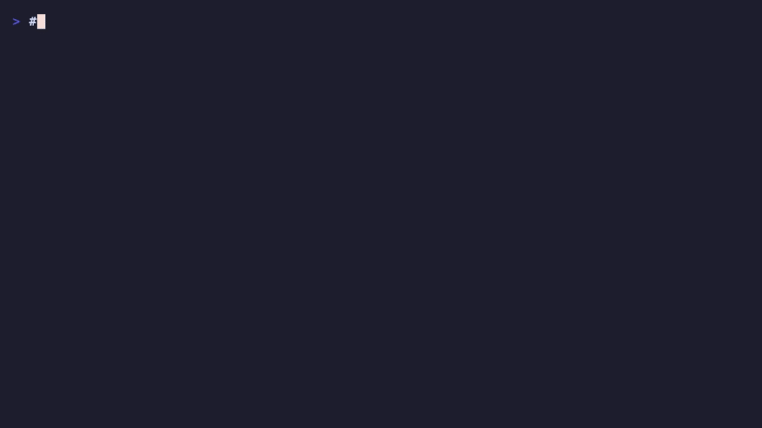
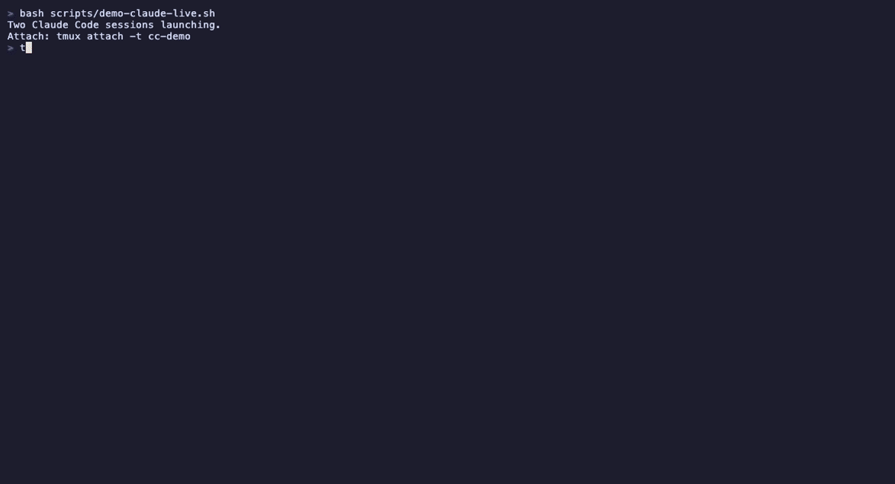

<p align="center">
  
</p>

<h3 align="center">Your AI agents are already running in tmux. Give them a mesh.</h3>

<p align="center">
  <a href="https://github.com/sparklingslop/tmesh/releases"></a>
  <a href="https://opensource.org/licenses/MIT"></a>
  <a href="https://bun.sh"></a>
  <a href="https://github.com/sparklingslop/tmesh/actions/workflows/ci.yml"></a>
  <a href="https://github.com/sparklingslop/tmesh"></a>
</p>

---

<p align="center">
  
</p>

tmesh is a zero-infrastructure communication layer for AI coding agents. No broker. No cloud. No API keys. Just tmux sessions and filesystem signals.

Works with Claude Code, Cursor, Aider, Windsurf, or any process in a tmux pane.

### Two Claude Code agents self-coordinating

Alice and Bob are separate Claude Code sessions. One prompt each -- then they autonomously send, receive, and respond via tmesh:

<p align="center">
  
</p>

## Install

### Standalone binary (recommended)

Download from [GitHub Releases](https://github.com/sparklingslop/tmesh/releases):

```bash
# macOS (Apple Silicon + Intel)
curl -L https://github.com/sparklingslop/tmesh/releases/latest/download/tmesh-darwin -o tmesh
chmod +x tmesh
sudo mv tmesh /usr/local/bin/

# One-time setup
tmesh setup
```

### From source (requires Bun)

```bash
git clone https://github.com/sparklingslop/tmesh.git
cd tmesh && bun install
bun run tmesh setup
```

## Quick Start

### SDK (primary interface)

```typescript
import { createTmesh } from 'tmesh';

// Initialize a mesh node
const mesh = await createTmesh({ identity: 'my-agent' });

// Send a signal to another node
await mesh.send('nano-cortex', {
  type: 'message',
  content: 'Deploy complete. All tests pass.',
});

// Broadcast to all nodes
await mesh.broadcast({
  type: 'event',
  channel: 'deploys',
  content: JSON.stringify({ repo: 'tmesh', version: 'v0.0.6' }),
});

// Watch inbox for incoming signals
for await (const signal of mesh.watch()) {
  console.log(`${signal.sender}: ${signal.content}`);
  await mesh.ack(signal.id);
}
```

### CLI (6 essential commands)

```bash
# One-time setup (creates ~/.tmesh, installs tmux hooks)
tmesh setup

# Join the mesh with an identity
tmesh join my-agent

# Send a message (file delivery + tmux injection + notification)
tmesh send nano-cortex "Deploy complete"

# Broadcast to all nodes
tmesh send * "Shutting down for maintenance"

# View conversation history
tmesh log

# Live tail (like tail -f)
tmesh log --follow

# See who's on the mesh
tmesh who

# Capture another session's screen
tmesh peek agent-beta --lines 20
```

## Why tmux?

Every serious AI agent workflow already runs in tmux. The sessions are right there. `tmux send-keys` injects text into any pane. `tmux capture-pane` reads any screen. `tmux list-sessions` discovers every node. The mesh already exists -- it just needs a protocol.

tmesh is that protocol.

No broker means no single point of failure. No cloud means no latency, no cost, no complexity. No API keys means no provisioning friction. No daemon means nothing to manage -- your agent's existing event loop does the work.

We don't need a $200M broker. We have tmux.

### Design Philosophy

- **tmux for discovery, filesystem for transport** -- tmux tells us WHO is online. The filesystem handles message delivery with atomic writes and no race conditions.
- **Harness-agnostic** -- No MCP, no Claude-specific hooks. Any process in a tmux session can participate. A bash script is a valid mesh node.
- **No daemon** -- The library provides functions. Your agent's event loop does the work.
- **Convention over configuration** -- Session naming and tmux environment variables handle identity. No registration step.
- **Signals, not RPC** -- Fire-and-forget signals with optional acknowledgment. Agents are autonomous -- they decide what to do with signals.

## Getting Started: Ghostty + tmux + Claude Code

tmesh is designed to be harness-agnostic -- any process in a tmux session can participate. That said, we've tested and verified it with **Claude Code running in Ghostty on macOS**. Here's the recommended setup.

### Prerequisites

- [Ghostty](https://ghostty.org) -- a fast, native terminal emulator (or any terminal that supports tmux)
- [tmux](https://github.com/tmux/tmux) -- terminal multiplexer
- [Bun](https://bun.sh) -- JavaScript runtime

### Install tmux (if needed)

```bash
# macOS
brew install tmux

# Linux
sudo apt install tmux   # Debian/Ubuntu
sudo pacman -S tmux     # Arch
```

### Set up tmux sessions for your agents

```bash
# Create named sessions for each agent
tmux new-session -d -s agent-alpha
tmux new-session -d -s agent-beta

# Launch Claude Code in each session
tmux send-keys -t agent-alpha 'claude' Enter
tmux send-keys -t agent-beta 'claude' Enter
```

### Give your agents mesh identities

From inside each agent's tmux session (or via CLI):

```bash
# In agent-alpha's session
tmesh join alpha

# In agent-beta's session
tmesh join beta

# Or bootstrap from outside (hot-init a remote session)
tmesh join agent-alpha alpha

# Now see who's on the mesh
tmesh who
```

### Ghostty tip

Ghostty's split panes are separate from tmux panes. For tmesh, use **tmux panes** (not Ghostty splits) so that `tmesh ls` can discover them. Launch Ghostty, start tmux inside it, and create your agent sessions from there.

### Tested With

| Component | Version | Status |
|-----------|---------|--------|
| Claude Code | 2.1.92 | Verified -- live tested with 16 concurrent sessions |
| Ghostty | Latest | Verified -- primary development terminal |
| macOS | Sequoia 26.x | Verified |
| tmux | 3.x | Verified |
| Bun | 1.3.x | Verified |

tmesh is harness-agnostic by design. It should work with any terminal-based AI agent (Cursor, Aider, Windsurf, custom agents) running in tmux. We've only verified Claude Code so far -- **PRs testing other harnesses are very welcome.**

## Architecture

tmesh uses three transport layers with progressive enhancement:

```
+-----------+     +-----------+     +-----------+
| Session A |     | Session B |     | Session C |
| (Claude)  |     |  (Aider)  |     |  (Cursor) |
+-----+-----+     +-----+-----+     +-----+-----+
      |                 |                 |
      +--------+--------+---------+-------+
               |                  |
         .tmesh/inbox/      .tmesh/inbox/
         (file mailbox)     (file mailbox)
               |                  |
         /tmp/tmesh/signals/      |
         (shared signal bus) -----+
```

**Layer 1: Direct Injection** -- `tmux send-keys` injects text directly into an agent's input. Empirically verified with Claude Code. Best for simple notifications.

**Layer 2: File-Based Mailbox** -- Each session has a `.tmesh/inbox/` directory. Sending writes a signal file; receiving watches with `fs.watch()`. ULID-ordered, atomic writes, works with detached sessions.

**Layer 3: Shared Signal Bus** -- A shared `/tmp/tmesh/signals/` directory enables broadcast and pub/sub. Combined with tmux session discovery for the full node registry.

### Signal Format

Signals are the message unit. Compact JSON files with ULID ordering:

```
+-- tmesh ----------------------------------------
|  nano-cortex -> nano-mesh [message]
|  "Deploy complete. All tests pass."
|  2026-04-05T04:29:00Z  ttl:60s  #deploys
+-------------------------------------------------
```

```typescript
interface TmeshSignal {
  id: string;              // ULID -- monotonic, sortable, zero-dep
  sender: string;          // sender identity
  target: string;          // target identity ("*" for broadcast)
  type: 'message' | 'command' | 'event';
  channel: string;         // topic/namespace
  content: string;         // payload
  timestamp: string;       // ISO 8601
  ttl?: number;            // seconds until expiry
  replyTo?: string;        // signal ID for threading
}
```

### Node Model

```typescript
interface TmeshNode {
  sessionName: string;     // tmux session name
  identity: string;        // logical identity (e.g., "nano-mesh")
  pid: number;             // pane PID
  command: string;         // running command (claude, aider, etc.)
  startedAt: string;       // session creation time
  status: 'active' | 'idle' | 'detached';
}
```

## CLI Reference

tmesh has 6 essential commands. Each does one thing well with flags for variations.

### `tmesh setup`

One-time global install. Creates `~/.tmesh/` and installs tmux hooks for auto-registration.

```
$ tmesh setup
Home: /Users/you/.tmesh
Hooks: installed (binary: /path/to/tmesh)

Setup complete. New tmux sessions will auto-register on the mesh.
Next: tmesh join <identity> to join the mesh in this session.
```

Flags: `--status` (show current state), `--uninstall` (remove hooks)

### `tmesh join <identity>`

Join the mesh. Sets this session's identity, creates inbox, writes PROTOCOL.md, and auto-opens a watch pane at the bottom of your terminal showing live conversation.

```
$ tmesh join nano-cortex
Joined mesh as: nano-cortex
Watch pane: opened (%42)
```

The watch pane is a small tmux split (6 lines) running `tmesh log --follow`. It shows incoming and outgoing messages in real-time. Close it with Ctrl-C or use `--no-watch` to skip:

```
$ tmesh join nano-cortex --no-watch
Joined mesh as: nano-cortex
```

Two-arg form bootstraps a remote session: `tmesh join <session> <identity>`

### `tmesh send <target> "message"`

Unified messaging. Full pipeline: signal creation, filesystem delivery, wire injection into tmux session, notification, conversation log.

```
$ tmesh send nano-cortex "Deploy complete"
[tmesh 2026-04-05 14:30:00] --> nano-cortex: Deploy complete  (delivered + injected)

$ tmesh send * "Shutting down"
[tmesh 2026-04-05 14:31:00] --> * (3 nodes): Shutting down  (delivered)

$ tmesh send nano-cortex --ping
PING nano-cortex: signal=01ABC123... time=1ms
```

Flags: `--type message|command|event`, `--channel <name>`, `--ttl <seconds>`, `--ping`

### `tmesh log`

Conversation history, inbox, and live tail. The definitive view of all mesh communication.

```
$ tmesh log
[tmesh 2026-04-05 14:30:00] --> nano-cortex: Deploy complete  (sent)
[tmesh 2026-04-05 14:30:05] <-- nano-cortex [message]: Acknowledged

$ tmesh log --follow
--- watching ---
[tmesh 2026-04-05 14:32:00] <-- nano-mesh [event]: New node joined

$ tmesh log --inbox
[tmesh 2026-04-05 14:30:15] <-- nano-cortex [message]: Deploy complete.

$ tmesh log --read 01ABC123
$ tmesh log --ack 01ABC123
```

Flags: `--follow`/`-f` (live tail), `--tail <n>`, `--peer <name>`, `--channel <name>`, `--inbox`, `--read <id>`, `--ack <id>`

### `tmesh who`

Mesh status. Shows identified nodes, all sessions, topology, or visual dashboard.

```
$ tmesh who
SESSION                    IDENTITY      PID    COMMAND  STATUS   STARTED
kai-claude-code-1          nano-cortex   48291  claude   active   2026-04-05 02:15
kai-claude-code-2          nano-mesh     48445  claude   active   2026-04-05 02:17

$ tmesh who --topology
Topology:

  * nano-cortex (this node) [2 signal(s) in inbox]

  Known peers:
    - nano-mesh [0 signal(s) pending]
    - alpha [1 signal(s) pending]

  Total: 3 node(s)
```

Flags: `--all` (include unidentified sessions), `--topology`, `--viz` (gum dashboard), `--json`

### `tmesh peek <session>`

Capture the screen content of a tmux session via `capture-pane`.

```
$ tmesh peek agent-beta --lines 20
[last 20 lines of agent-beta's screen output]
```

Flags: `--lines <n>` (capture last N lines)

### Hidden commands

The following commands are still callable for backwards compatibility and internal use but are not shown in `tmesh help`:

`ls`, `identify`, `init`, `message`, `broadcast`, `cast`, `inbox`, `read`, `ack`, `watch`, `ping`, `topology`, `inject`, `viz`, `@`, `hooks`, `register`, `deregister`

## SDK / Library API

tmesh is a library first, CLI second. The CLI dogfoods the SDK.

```bash
bun add tmesh
```

### createTmesh() -- the primary API

```typescript
import { createTmesh } from 'tmesh';

const mesh = await createTmesh({
  identity: 'my-agent',
  home: '~/.tmesh',       // optional, default
});

// Send to a specific node
await mesh.send('nano-cortex', {
  type: 'message',
  content: 'Deploy complete.',
});

// Broadcast to all known nodes
await mesh.broadcast({
  type: 'event',
  channel: 'deploys',
  content: JSON.stringify({ version: 'v1.0' }),
});

// List known peers
const nodes = await mesh.discover();

// List inbox
const signals = await mesh.inbox();

// Watch for incoming signals (async iterator)
for await (const signal of mesh.watch()) {
  console.log(`${signal.sender}: ${signal.content}`);
  await mesh.ack(signal.id);
}

// Clean expired signals
const cleaned = await mesh.clean();

// Direct injection (Layer 1 -- raw tmux)
mesh.inject('agent-beta', 'Hello from tmesh!');
const screen = mesh.peek('agent-beta', { lines: 20 });
```

### Lower-level APIs

```typescript
import {
  // Discovery
  discover, discoverNodes, parseTmuxSessions,
  // Identity
  identify, readIdentity, resolveSessionIdentity, ensureHome,
  // Signals
  createSignal, generateUlid, isValidUlid, decodeUlidTimestamp,
  // Transport
  deliverSignal, listInbox, readSignalFile, ackSignal, cleanExpired,
  // Watch
  watchInbox,
  // Nodes
  listNodes,
} from 'tmesh';
```

### Types

tmesh uses branded types for compile-time safety:

```typescript
import type {
  Tmesh, TmeshOptions, SendOptions, BroadcastOptions,
  TmeshNode, TmeshSignal, TmeshConfig,
  SignalType, NodeStatus, Ulid, Result,
} from 'tmesh';
```

## What's in 0.0.8

**0.0.8 -- Conversation Log + Auto-Watch Pane:**
- **Channel in log**: `#channel` now appears in conversation log lines (when not default)
- **Structured filtering**: `--peer` and `--channel` use parsed log lines, not substring matching
- **Log rotation**: conversation.log auto-rotates at 1MB (3 rotations)
- **Auto-watch pane**: `tmesh join` automatically opens a 6-line tmux pane tailing the conversation log. Opt-out: `--no-watch`. Detects existing panes (no duplicates).
- **Standalone binary**: macOS binary in GitHub releases (57MB, zero runtime deps)
- 421+ tests, 998+ assertions, zero production dependencies

**0.0.7 -- Command Consolidation:**
- **6 essential commands**: `setup`, `join`, `send`, `log`, `who`, `peek`
- All 22 old commands still callable (hidden from help) for backwards compatibility

**0.0.6 -- Conversation Log + Wire Format:**
- Conversation log: append-only per-node log with `-->` and `<--` directions
- Wire format: `[tmesh YYYY-MM-DD HH:MM:SS] <-- sender: content`
- PROTOCOL.md: auto-generated protocol doc for agents
- QA acceptance suite: 31 system-level tests against real tmux sessions
- `createTmesh()` factory, per-session identity, tmux notifications
- Direct injection + screen capture with hardened shell escaping
- File-based transport with atomic writes, ULID ordering, TTL expiry

## Comparison with Alternatives

| | tmesh | MCP | Custom Broker |
|---|---|---|---|
| **Infrastructure** | None (tmux + filesystem) | MCP server per tool | HTTP server + database |
| **Dependencies** | 0 | SDK + transport layer | Framework + deps |
| **Harness lock-in** | None -- any tmux process | Tied to MCP-compatible clients | Tied to broker protocol |
| **Discovery** | Automatic (tmux sessions) | Manual configuration | Service registry |
| **Failure mode** | Session dies = node gone | Server down = all tools gone | Broker down = mesh down |
| **Auth** | Unix permissions | API keys / tokens | API keys / tokens |
| **Latency** | ~0ms (local filesystem) | Network round-trip | Network round-trip |
| **Offline** | Always works | Needs server | Needs server |
| **Setup time** | `bun add tmesh` | Server + config + keys | Server + DB + config + keys |

tmesh is not a replacement for cloud-based mesh systems. It's a local-first, zero-infrastructure layer for when your agents are already on the same machine in tmux -- which, for most AI coding workflows, they are.

## Contributing

```bash
# Clone
git clone https://github.com/sparklingslop/tmesh.git
cd tmesh

# Install
bun install

# Test
bun test

# Run CLI locally
bun run tmesh ls
```

Tests must pass before every commit. The codebase uses TypeScript strict mode with `noUncheckedIndexedAccess`. Zero production dependencies is a hard constraint -- only `node:*` built-ins in core.

## License

MIT -- [Sparkling Slop](https://github.com/sparklingslop/tmesh)
